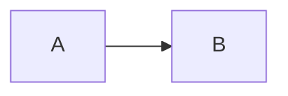

# 内容写作指南

这个目录是网站的唯一内容源。新增内容时，只需要创建 `.mdx` 文件，不需要修改页面代码。

## 基础 Frontmatter

```yaml
---
slug: my-note
type: note # note / photo / project
title: 标题
summary: 一句话摘要
date: 2026-07-27
tags:
  - Design
featured: false
---
```

摄影内容可额外使用 `cover`、`location`；项目内容可额外使用 `cover`、`link`、`status`。

## Tiptap 自定义节点

正文会由 Tiptap 以只读模式渲染。支持标准 Markdown，并补充了以下节点。

### Callout

```md
> [!TIP]
> 这里写提示内容。
```

可用类型：`NOTE`、`TIP`、`IMPORTANT`、`WARNING`、`CAUTION`。

### 图片与图注

```md

```

图片支持点击放大和键盘 `Esc` 关闭。

### 代码与 Mermaid

使用标准 fenced code block。语言写 `mermaid` 时会自动渲染为图表。

````md

````

### 表格

使用标准 GFM 表格语法，窄屏下会自动横向滚动，并适配浅色与深色主题。

```md
| 节点 | 用途 |
| --- | --- |
| Callout | 补充说明 |
| Mermaid | 流程图 |
```

### 数学公式

```md
行内公式：\(E = mc^2\)

\[
\int_0^1 x^2 dx
\]
```

### YouTube / Bilibili

```html
<video-embed data-provider="youtube" data-video-id="VIDEO_ID"></video-embed>
<video-embed data-provider="bilibili" data-video-id="BV_ID"></video-embed>
```

### 地图

```html
<map-embed data-query="Shanghai, China"></map-embed>
```

### 文件与音频

```html
<gh-file data-src="/files/guide.pdf" data-name="guide.pdf"></gh-file>
<gh-audio data-src="/audio/field-note.mp3" data-name="Field note"></gh-audio>
```

这些标签借鉴了 Revornix 的节点格式，因此内容在两个项目之间迁移时不需要重新设计数据结构。

音频节点和文章朗读都会交给全站播放器。开始播放后，即使继续浏览其他笔记、摄影或项目，音频也不会中断；最近播放与播放队列可以在 `/player` 页面管理。

## 站内 BGM

背景音乐文件统一放在 `public/audio/bgm/`，曲目信息集中定义在 `lib/audio.ts` 的 `backgroundTracks` 中。新增一首 BGM 时：

1. 把 `.ogg`、`.mp3` 或其他浏览器支持的音频文件放进 `public/audio/bgm/`；
2. 在 `backgroundTracks` 中补充中英文标题、作者、说明、文件路径和强调色；
3. 重新构建网站。

建议使用自己拥有版权或明确允许使用的声音素材，不要直接引用来源不明的第三方音乐地址。
