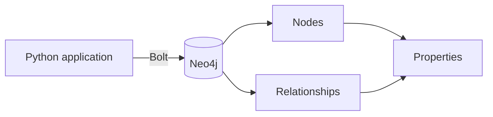

# Neo4j with Python

Neo4j stores information as nodes, relationships, and properties. The official Python driver lets an application communicate with the database over Bolt while keeping Cypher queries explicit.



> [!NOTE]
> These examples focus on the driver layer. In production, keep credentials in environment variables and add complete session-level error handling.

## Install and connect

```shell
pip install neo4j
```

```python
from neo4j import GraphDatabase

uri = "bolt://localhost:7687"
username = "neo4j"
password = "your_password"

driver = GraphDatabase.driver(uri, auth=(username, password))
```

## Create, read, update, and delete nodes

```python
def create_node(tx, node_id, label):
    query = "CREATE (n:Animal {custom_id: $node_id, label: $label})"
    tx.run(query, node_id=node_id, label=label)

def get_node(tx, node_id):
    query = "MATCH (n:Animal {custom_id: $node_id}) RETURN n"
    return tx.run(query, node_id=node_id).single()

def update_node(tx, node_id, new_label):
    query = """
    MATCH (n:Animal {custom_id: $node_id})
    SET n.label = $new_label
    """
    tx.run(query, node_id=node_id, new_label=new_label)

def delete_node(tx, node_id):
    query = """
    MATCH (n:Animal {custom_id: $node_id})
    DETACH DELETE n
    """
    tx.run(query, node_id=node_id)
```

Use explicit read and write transactions so retry and routing behavior remain predictable:

```python
with driver.session() as session:
    session.execute_write(create_node, "animal_1", "Dog")
    record = session.execute_read(get_node, "animal_1")
```

## Relationships

```python
def connect_animals(tx, source_id, target_id):
    query = """
    MATCH (a:Animal {custom_id: $source_id})
    MATCH (b:Animal {custom_id: $target_id})
    CREATE (a)-[:KNOWS]->(b)
    """
    tx.run(query, source_id=source_id, target_id=target_id)
```

To remove a relationship without deleting either node:

```python
def disconnect_animals(tx, source_id, target_id):
    query = """
    MATCH (a:Animal {custom_id: $source_id})
          -[r:KNOWS]->
          (b:Animal {custom_id: $target_id})
    DELETE r
    """
    tx.run(query, source_id=source_id, target_id=target_id)
```

## Constraints and indexes

Create schema rules before loading production data:

```cypher
CREATE CONSTRAINT animal_custom_id IF NOT EXISTS
FOR (n:Animal) REQUIRE n.custom_id IS UNIQUE;

CREATE INDEX animal_label IF NOT EXISTS
FOR (n:Animal) ON (n.label);
```

The unique constraint protects identity; the index accelerates common label lookups.

## Batch creation

`UNWIND` keeps bulk writes in one query:

```python
def create_many(tx, nodes):
    query = """
    UNWIND $nodes AS item
    CREATE (n:Animal {
        custom_id: item.custom_id,
        label: item.label
    })
    """
    tx.run(query, nodes=nodes)

nodes = [
    {"custom_id": "animal_1", "label": "Dog"},
    {"custom_id": "animal_2", "label": "Cat"},
    {"custom_id": "animal_3", "label": "Fox"},
]

with driver.session() as session:
    session.execute_write(create_many, nodes)
```

Always close the driver when the application shuts down:

```python
driver.close()
```
