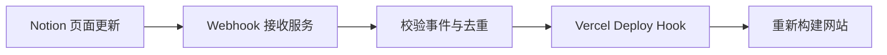

Notion 支持 Webhook 以后，许多依赖轮询的自动化终于可以改成事件驱动。

对内容网站来说，一个很直接的应用是：Notion 页面发生变化时，由 Webhook 通知一个轻量服务，再通过 Vercel Deploy Hook 触发网站重新构建。

## 最小链路

1. 为现有 Notion Integration 开启对应的事件订阅。
2. 部署一个公开的 Webhook 接收地址。
3. 完成平台要求的签名校验或验证流程。
4. 对重复事件做幂等处理，避免连续触发多次部署。
5. 调用 Vercel Deploy Hook，并记录构建结果。

以前需要定时检查“内容有没有变化”，现在只在变化真正发生时工作。链路更及时，也减少了没有意义的请求。

> [!NOTE]
> Webhook 接收成功不代表部署一定成功。生产环境还需要保存事件状态，并为调用失败增加重试和告警。
