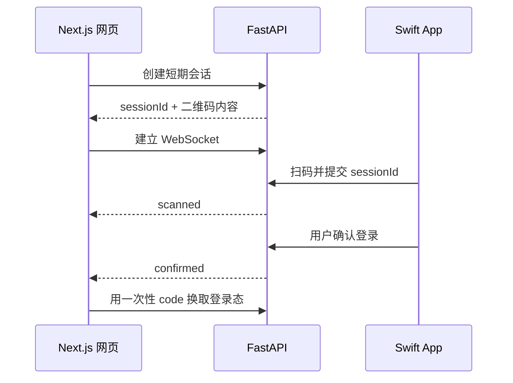

扫码登录的核心不是二维码本身，而是让浏览器和手机共同订阅同一次短期登录会话。

## 1. 创建会话

网页请求 FastAPI 创建随机 `sessionId`。服务端保存它的状态、过期时间和发起设备信息，再把只包含短期会话标识的二维码返回给网页。

二维码不要直接携带访问 Token，也不要放入长期有效的用户信息。

## 2. 同步扫码状态

网页用 `sessionId` 建立 WebSocket。Swift App 扫码后，把会话标识和当前已登录用户提交给服务端。服务端校验会话仍然有效，再向网页发送 `scanned`，让界面显示“已扫码，等待确认”。

## 3. 在手机端确认

扫码不应自动完成登录。手机端需要展示目标设备和操作说明，由用户明确确认或拒绝。

确认后，服务端将会话更新为 `confirmed`，并向网页发送一个短期、一次性的授权 code。网页再通过 HTTPS 用 code 换取 Cookie 或 Token。

## 4. 必须考虑的边界

- 会话应在几分钟内过期，成功或取消后立即失效。
- 状态只能按 `pending → scanned → confirmed` 前进。
- WebSocket 断开后，网页可以通过一次普通请求恢复当前状态。
- 服务端应限制创建和扫码频率，并记录异常尝试。
- 浏览器的长期登录凭证不要通过 WebSocket 明文下发。

这样拆分后，Next.js 负责展示，Swift 负责确认，FastAPI 保持唯一可信状态。
